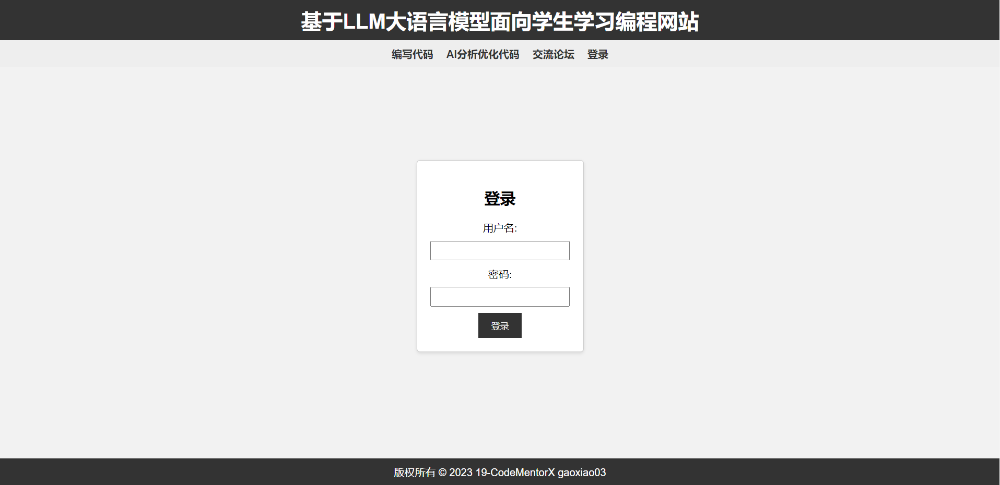
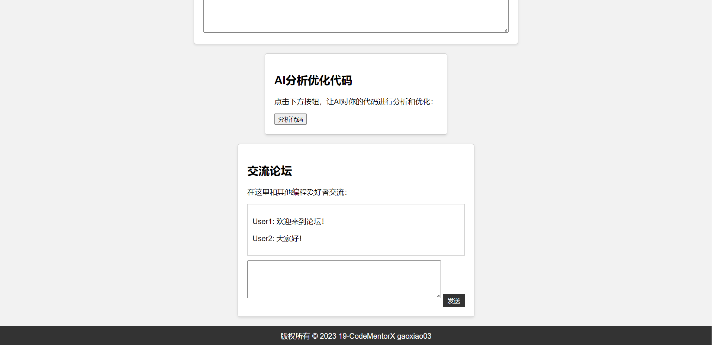

<h1 align="center">基于LLM大语言模型面向学生学习编程网站</h1>
 

---

## 👨‍💻 小组成员

---

 

[高效](https://github.com/gaoxiao03)

[洪均钰](https://github.com/hjyv)

[秦伯恒](https://github.com/bieke823/)

[别克](https://github.com/bieke823/)
    

---

## 📗 简介

---

 

CodeMentorX是一个基于LLM大语言模型的开源项目，旨在为学生提供学习编程的网站。

 

---

## 🛠 功能列表

---

 

### AI辅助编程

1、代码优化AI：CodeMentorX将集成强大的人工智能技术，可以帮助用户优化他们的代码。用户可以输入他们的代码，并获得智能建议和改进方案，以改善代码的质量、效率和可读性。这将帮助学生学习编写更好的代码，并提升他们的编程技能。

### 用户交流论坛

2、用户交流论坛：CodeMentorX将拥有一个用户交流论坛，让学生之间可以互相交流、讨论编程问题、分享经验和解决方案。论坛将提供主题分类、帖子评论功能，以促进积极的学习和合作氛围。
 
 

---

## 📸 在线访问
---

<https://bistu-ossdt-2023.github.io/19-CodeMentorX/>

---

## LICENSE

---

 
    
MIT许可证

 

---

## 🎁 感谢

---

 
导师：王安忆
 
 

---

## FAQ

---

 
1、用户登录并输入账号和密码后，将跳转到主页面。
 
2、在代码编辑框中输入你想要优化练习的代码。
 
3、点击"分析代码"，AI将对你的代码进行分析、优化，并指出代码中的错误，并给出建议和学习方法。
 
4、当你完善了代码后，可以在交流论坛中分享你的代码。其他用户可以查看你的代码，并给你留言，进行相互学习和交流。
 
 

---

## 网页页面

---

登陆界面

主页面

